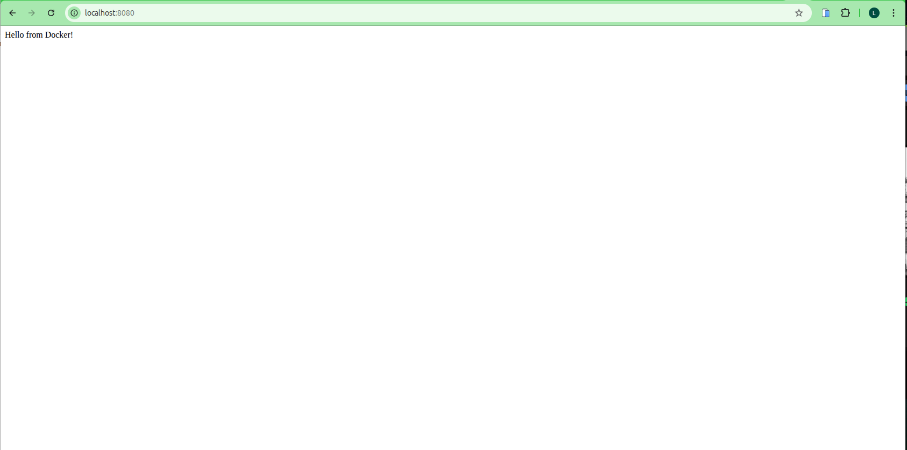

# Docker Flask Application with Nginx Reverse Proxy

## Project Overview

This project demonstrates how to containerize a Flask web application using Docker and set up an Nginx reverse proxy to handle incoming traffic. The application follows a microservices architecture where the Flask backend and Nginx proxy run as separate containers communicating through Docker networking.

## Architecture

```
Client Request (Port 8080)
        |
        v
Nginx Reverse Proxy Container (Port 80)
        |
        v
Docker Network (flask-network)
        |
        v
Flask Application Container (Port 5000)
        |
        v
Response: "Hello from Docker!"
```

## Project Structure

```
.
├── app.py                 # Flask application source code
├── Dockerfile             # Docker image configuration for Flask app
├── Dockerfile.nginx       # Docker image configuration for Nginx proxy
├── nginx.conf             # Nginx reverse proxy configuration
├── assets/
│   └── web1.png          # Application screenshot
├── assignment.pdf         # Project requirements document
└── README.md             # Project documentation
```

## Components

### 1. Flask Application (app.py)

A simple Flask web application that serves a "Hello from Docker!" message on port 5000.

**Features:**
- Lightweight Python web server
- Listens on all interfaces (0.0.0.0)
- Containerized using Python 3.9-slim base image

### 2. Flask Dockerfile

Containerizes the Flask application with the following specifications:
- Base Image: `python:3.9-slim`
- Working Directory: `/app`
- Exposes Port: 5000
- Installs Flask dependency via pip

### 3. Nginx Configuration (nginx.conf)

Configures Nginx as a reverse proxy with:
- Upstream server pointing to Flask container
- Listens on port 80
- Proxy headers for proper request forwarding
- Worker connections: 1024

**Key Configuration:**
```nginx
upstream flask_app {
    server flask-container:5000;
}
```

### 4. Nginx Dockerfile

Creates a lightweight Nginx container using:
- Base Image: `nginx:alpine`
- Custom configuration: Copies nginx.conf to /etc/nginx/nginx.conf
- Exposes Port: 80

## Prerequisites

- Docker installed (version 20.10 or higher)
- Docker Compose (optional, for easier orchestration)
- Basic understanding of containerization concepts
- Linux, macOS, or Windows with WSL2

## Installation and Setup

### Step 1: Clone the Repository

```bash
git clone https://github.com/KofiAckah/Docker-Sample-Application
cd Docker-Sample-Application
```

### Step 2: Create Docker Network

Create a bridge network for container communication:

```bash
docker network create flask-network
```

### Step 3: Build Flask Application Image

```bash
docker build -t flask-app .
```

### Step 4: Build Nginx Proxy Image

```bash
docker build -f Dockerfile.nginx -t nginx-proxy .
```

### Step 5: Run Flask Container

```bash
docker run -d --name flask-container --network flask-network flask-app
```

### Step 6: Run Nginx Proxy Container

```bash
docker run -d -p 8080:80 --name nginx-proxy-container --network flask-network nginx-proxy
```

## Usage

### Access the Application

Once both containers are running, access the application through the Nginx proxy:

```bash
curl http://localhost:8080
```

Expected Output:
```
Hello from Docker!
```

Or open in a web browser:
```
http://localhost:8080
```

### Verify Container Status

Check if both containers are running:

```bash
docker ps --filter "name=flask-container" --filter "name=nginx-proxy-container"
```

### View Container Logs

**Flask application logs:**
```bash
docker logs flask-container
```

**Nginx proxy logs:**
```bash
docker logs nginx-proxy-container
```

### Test Internal Networking

Execute a command inside the Nginx container to test connectivity:

```bash
docker exec nginx-proxy-container wget -qO- http://flask-container:5000
```

## Docker Networking Explained

### Why Docker Networks?

Docker networks enable containers to communicate with each other using container names as DNS hostnames. This provides:

1. **Service Discovery**: Containers can reference each other by name
2. **Isolation**: Network traffic is isolated from the host and other networks
3. **Portability**: Works consistently across all platforms (Linux, Mac, Windows)
4. **Security**: Containers not on the same network cannot communicate

### Container Name Resolution

In the nginx.conf file, we use:
```nginx
server flask-container:5000;
```

Docker's embedded DNS server resolves `flask-container` to the container's internal IP address automatically within the `flask-network` bridge network.

### Alternative Approach: host.docker.internal

On Docker Desktop (Mac/Windows), you can use `host.docker.internal` to reference services on the host machine. However, this approach:
- Does not work on Linux by default
- Requires additional flags: `--add-host=host.docker.internal:host-gateway`
- Is less portable than using Docker networks

**We use Docker networks for better compatibility and best practices.**

## Configuration Details

### Nginx Proxy Settings

The nginx.conf includes important proxy headers:

```nginx
proxy_set_header Host $host;
proxy_set_header X-Real-IP $remote_addr;
proxy_set_header X-Forwarded-For $proxy_add_x_forwarded_for;
proxy_set_header X-Forwarded-Proto $scheme;
```

**Purpose:**
- `Host`: Preserves the original host header
- `X-Real-IP`: Forwards the client's real IP address
- `X-Forwarded-For`: Tracks proxied request chain
- `X-Forwarded-Proto`: Indicates the original protocol (http/https)

### Port Mapping

- **Flask Container**: Internal port 5000 (not exposed to host)
- **Nginx Container**: Internal port 80, mapped to host port 8080
- **Client Access**: localhost:8080

This configuration means only the Nginx proxy is accessible from the host machine, providing an additional security layer.

## Troubleshooting

### Issue: Cannot connect to localhost:8080

**Solution:**
1. Check if containers are running:
   ```bash
   docker ps
   ```
2. Verify container logs for errors:
   ```bash
   docker logs nginx-proxy-container
   docker logs flask-container
   ```

### Issue: Nginx container exits immediately

**Solution:**
Check Nginx configuration syntax:
```bash
docker run --rm nginx-proxy nginx -t
```

### Issue: "host not found in upstream" error

**Cause:** Containers are not on the same network

**Solution:**
Ensure both containers are attached to the same network:
```bash
docker network inspect flask-network
```

### Issue: Port already in use

**Solution:**
Stop any service using port 8080 or change the port mapping:
```bash
docker run -d -p 9090:80 --name nginx-proxy-container --network flask-network nginx-proxy
```

## Cleanup

### Stop and Remove Containers

```bash
docker stop flask-container nginx-proxy-container
docker rm flask-container nginx-proxy-container
```

### Remove Docker Network

```bash
docker network rm flask-network
```

### Remove Docker Images

```bash
docker rmi flask-app nginx-proxy
```

### Complete Cleanup Script

```bash
#!/bin/bash
docker stop flask-container nginx-proxy-container 2>/dev/null
docker rm flask-container nginx-proxy-container 2>/dev/null
docker network rm flask-network 2>/dev/null
docker rmi flask-app nginx-proxy 2>/dev/null
echo "Cleanup complete"
```

## Project Requirements

Based on the assignment specifications, this project implements:

1. **Containerized Flask Application**: Simple web server running in Docker
2. **Nginx Reverse Proxy**: Separate container handling HTTP traffic
3. **Docker Networking**: Bridge network for inter-container communication
4. **Port Mapping**: External access via port 8080
5. **Configuration Management**: Custom nginx.conf for proxy settings
6. **Multi-container Orchestration**: Coordinated deployment of services

## Screenshot



The screenshot shows the Flask application successfully responding through the Nginx reverse proxy.

## Best Practices Implemented

1. **Separation of Concerns**: Application and proxy run in separate containers
2. **Minimal Base Images**: Using slim/alpine variants for smaller image sizes
3. **Network Isolation**: Containers communicate via dedicated Docker network
4. **Single Process per Container**: Each container runs one main process
5. **Explicit Port Exposure**: Only necessary ports are exposed
6. **Configuration as Code**: All settings stored in version control
7. **Container Naming**: Descriptive names for easy management

## Advanced Usage

### Using Docker Compose (Optional)

Create a `docker-compose.yml` file:

```yaml
version: '3.8'

services:
  flask-app:
    build:
      context: .
      dockerfile: Dockerfile
    container_name: flask-container
    networks:
      - flask-network
    expose:
      - "5000"

  nginx-proxy:
    build:
      context: .
      dockerfile: Dockerfile.nginx
    container_name: nginx-proxy-container
    ports:
      - "8080:80"
    networks:
      - flask-network
    depends_on:
      - flask-app

networks:
  flask-network:
    driver: bridge
```

Run with:
```bash
docker-compose up -d
```

### Health Checks

Add health checks to monitor container status:

```bash
docker run -d \
  --name flask-container \
  --network flask-network \
  --health-cmd="curl -f http://localhost:5000 || exit 1" \
  --health-interval=30s \
  --health-timeout=3s \
  --health-retries=3 \
  flask-app
```

## Learning Objectives

This project demonstrates:

- Docker containerization fundamentals
- Multi-container application architecture
- Nginx reverse proxy configuration
- Docker networking concepts
- Container orchestration basics
- Port mapping and exposure
- Configuration management in containers

## References

- Docker Documentation: https://docs.docker.com/
- Nginx Documentation: https://nginx.org/en/docs/
- Flask Documentation: https://flask.palletsprojects.com/
- Repository: https://github.com/KofiAckah/Docker-Sample-Application

## Author

Joel Livingstone Kofi Ackah

## License

This project is for educational purposes as part of a Docker learning assignment.

## Version History

- v1.0 (2026-02-11): Initial implementation with Flask app and Nginx reverse proxy
  - Flask application containerized
  - Nginx reverse proxy configured
  - Docker networking implemented
  - Documentation completed